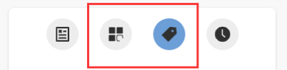

## MarkdownFrontmatter配置
每次写东西前，都需要配置页面的 Frontmatter 于是我就写下来一些常用的 Frontmatter 方便随时查看，再有就是一些配置项目经常会忘了其作用是什么，下面就详细列取了一些常用的并注释了用法。
```bash
date: 2024-10-21
title: 《MarkdownFrontmatter配置》
icon: fab fa-markdown
order: 1
category:
    - 使用指南
tag:
    - Markdown
excerpt: <p>MarkdownFrontmatter配置</p>
headerDepth: 6

index: false
timeline: false
article: false
```

### 1. date
写作时间，格式: `YYYY-MM-DD` 或 `YYYY-MM-DD hh:mm:ss`

似乎不支持详细到分钟秒。详细的配置可以查看[官方文档](https://theme-hope.vuejs.press/zh/guide/feature/page-info.html#%E5%86%99%E4%BD%9C%E6%97%A5%E6%9C%9F)

### 2. title
当前页面内容标题，默认为 Markdown 文件中的第一个 h1 标签内容。

**shortTitle**

当前页面的短标题，会在导航栏、侧边栏和路径导航中作为首选。

### 3. icon
当前页面图标的 FontClass 或文件路径 (建议填写)。

对于单页文章其实不是必须的，如果是文件夹，需要在 navbar 或者sidebar 中显示可以设置。

### 4. order
控制文章在侧边栏中的排序

通常情况下需要在 主题的配置文件中设置你的排序规则。
具体的排序配置项可以查看[官方文档](https://theme-hope.vuejs.press/zh/guide/layout/sidebar.html#%E8%BF%9B%E9%98%B6%E6%8E%A7%E5%88%B6)。
```ts{4}
export default hopeTheme({
    // ...

    sidebarSorter: ["order","date-desc"],
})
```
::: tip
`readme`: README.md 或 readme.md 在前

`order`: 正序在前并按其值升序排列，负序在后并按其值降序排列

`date`: 按日期升序排序

`date-desc`: 按日期降序排序

`title`: 按标题字母顺序排序

`filename`: 按文件名字母顺序排序
:::

### 5. category
只需要在页面 frontmatter 中设置 category 数组，并设置一个或多个文章所属的分类，该文章会自动渲染在 `/category/<分类名>/` 分类页面的列表中。

你就可以在 `/category/html` 和 `/category/web` 页面下找到它。
### 6. tag
只需要在页面的 frontmatter 中设置 `tag`，并设置一个或多个文章所属的标签，该文章会自动渲染在 `/tag/<标签名>/` 标签页面的列表中。

你就可以在 `/tag/html` 和 `/tag/web `页面下找到它。

你可以从一下两个入口找到他们




### 7. excerpt
对于文章在首页列表中的描述通常可以用 `<!-- more -->` 来注释，但是它们会出现在文章的正文中，如果要避免这个情况，可以使用 `excerpt` 来放置摘要。

`excerpt`  可以直接写 `HTML` 语句。

例如这样：
```md
excerpt: <p>浏览器的缓存机制也就是我们说的 HTTP 缓存机制，其机制是根据 HTTP 报文的缓存标识进行的。 </p><p>在前端开发中，我们追求性能和用户体验。对于一个网站，查看性能最简单的方式就是打开网站的速度。 </p>
```
### 8. headerDepth
默认情况下，VuePress 只会从 Markdown 提取 h2 和 h3 标题

你需要在 VuePress 配置文件中配置[markdown.headers.level](https://vuejs.press/zh/reference/config.html#markdown-frontmatter)
```ts{7-12} title=".vuepress/config.ts"
import { defineUserConfig } from "vuepress";

export default defineUserConfig({
  // 其他站点配置
  // ...

  markdown: {
    headers: {
      // 用到哪一级就提取哪一级
      level: [2, 3, 4, 5, 6],
    },
  },
});
```
在上方提取更深层级的标题后，你就能在 主题选项 或 页面 **Frontmatter** 中通过增加 **headerDepth** 的数值来展示更多标题了。

## README 的 frontmatter
关于每个分类以及其子集分类的 README 的 frontmatter 的设置，可能是你不希望它出现在 article，分类，时间线，标签，sidebar等列表中，你可以设置一下属性：
```shell
article: false  # 此篇文章不会加入 VuePress 的默认文章分类
timeline: false # 此篇文章不会加入 VuePress 的默认时间线分类
index: false    # 此篇文章不会加入 VuePress 的侧边栏或目录中。

```

那解释一下，它们都接收一个布尔值，默认为 true。不过你不希望那一篇文章加入相应的分类，你可以指定其属性为 false ，如果不指定默认就是 true。

对于一个分组的 README 来讲，只是用来生成分类目录，和展现当前分组下的描述等作用，并不需要出现在 article 分类或者时间线等分类中，所以将这些 frontmatter 设置为 false 就可以了。
