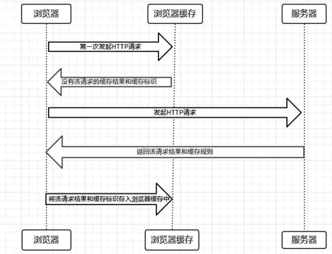

--- 
date: 2024-10-19
title: 《浏览器的缓存机制和原理》
category: 
- 前端
- 浏览器原理
tag:
- 浏览器原理
- 游览器缓存
- 面试
headerDepth: 6
excerpt: <p>浏览器的缓存机制也就是我们说的 HTTP 缓存机制，其机制是根据 HTTP 报文的缓存标识进行的。 </p><p>在前端开发中，我们追求性能和用户体验。对于一个网站，查看性能最简单的方式就是打开网站的速度。 </p><p>而一个好的缓存策略可以大大提升网站的性能，使得已经下载后的资源被重复利用，减少客户端和服务器之间的请求次数，减少带宽，减少网络负荷。缓存可以说是性能优化中简单高效的一种优化方式了。 </p>
---

# 浏览器的缓存机制和原理


浏览器的缓存机制也就是我们说的 HTTP 缓存机制，其机制是根据 HTTP 报文的缓存标识进行的。

在前端开发中，我们追求性能和用户体验。对于一个网站，查看性能最简单的方式就是打开网站的速度。

而一个好的缓存策略可以大大提升网站的性能，使得已经下载后的资源被重复利用，减少客户端和服务器之间的请求次数，减少带宽，减少网络负荷。缓存可以说是性能优化中简单高效的一种优化方式了。

对于一个数据请求来说，可以分为发起**网络请求**、**后端处理**、**浏览器响应**三个步骤。浏览器缓存可以帮助我们在第一和第三步骤中优化性能。比如说直接使用缓存而不发起请求，或者发起了请求但后端存储的数据和前端一致，那么就没有必要再将数据回传回来，这样就减少了响应数据。


````markmap
---
markmap:
  colorFreezeLevel: 2
---

# 浏览器的缓存机制和原理

## 强缓存

- Expires(http 1.0) 
    - 通过 Expires 字段设置时间,控制缓存有效期,缺点是不准确
- Cache-Control(http1.1) 

## 协商缓存
- Last-Modified <br> If-Modified-Since (http 1.0) 
    - 通过 Last-Modified 字段设置时间，控制缓存有效期，缺点是不准确
- Etag 和 if-nano-Math(http 1.1) 

## 缓存位置
- 1. servic worker
- 2. Memory cache
- 3. Disk cache
- 4. push cache

````


## 1. **缓存过程分析**

浏览器与服务器通信的方式为应答模式。

即：浏览器发起HTTP请求———服务器响应该请求。浏览器第一次向服务器发起该请求，拿到请求结果后，会根据响应报文中响应头的缓存标识，决定是否缓存结果，缓存，则将请求结果和缓存标识存入浏览器缓存中。


 
::: important 由此可知，浏览器的缓存机制是：
1. 浏览器**每次**发起请求，都会先在浏览器缓存中查找该请求**结果**以及**缓存标识**。
2. 浏览器每次拿到返回的请求结果都会将该结果和缓存标识存入**浏览器缓存中**。
:::


通常浏览器缓存策略分为两种：强缓存和协商缓存，并且缓存策略都是通过设置 `HTTP Header` 来实现的。 

当存在缓存时，客户端第一次向服务器请求数据时，客户端会缓存到内存或者硬盘当中，当第二次获取相同的资源，强缓存和协商缓存的应对方式有所不同。

**强缓存**：当客户端第二次向服务器请求相同的资源时，不会向服务器发送请求，而是直接从 **内存/硬盘** 中读取。

**协商缓存**：当客户端第二次向服务器请求相同的资源时，先向服务器发送请求 **"询问"** 该请求的文件缓存在本地与服务器相比是否更改，如果更改，则更新文件，如果没有就从内存/硬盘中读取。


## 2. **强缓存**

强缓存就是向浏览器缓存查找请求结果，并根据该结果的缓存规则来决定是否使用该缓存结果的过程

强缓存不会向服务器发送请求，直接从缓存中读取资源，在 chrome 控制台的 Network 选项中可以看到该请求返回 200 的状态码，并且 Size 显示from disk cache 或 from memory cache。

强缓存可以通过设置两种 HTTP Header 实现：**`Expires`** 和 **`Cache-Control`**。

- 强缓存的情况主要有以下三种：
    1. 不存在该缓存结果和缓存标识，强缓存失效，则直接向服务器发起请求(跟第一次发起请求一致)
    2. 存在该缓存结果和缓存标识，但是结果已经失效，强缓存失效，则使用协商缓存
    3. 存在该缓存结果和缓存标识，且该结果没有还没有失效，强缓存生效，直接返回该结果

当浏览器向服务器发送请求的时候，服务器会将缓存规则放入 **HTTP响应报文** 的**HTTP头**中和请求结果一起返回给浏览器，控制强缓存的字段分别是 `Expires` 和 `Cache-Control`，其中 `Cache-Conctrol` 的优先级比`Expires`高。

### 1. Expires

缓存过期时间，用来指定资源到期的时间，是服务器端的具体的时间点。也就是说，Expires=max-age + 请求时间，需要和Last-modified结合使用。

Expires是Web服务器响应消息头字段，在响应http请求时告诉浏览器在过期时间前浏览器可以直接从浏览器缓存取数据，而无需再次请求。例如：Expires:Wed,22Oct201808:41:00GMT表示资源会在 Wed, 22 Oct 2018 08:41:00 GMT 后过期，需要再次请求。

Expires 是 HTTP/1 的产物，受限于本地时间，如果修改了本地时间，可能会造成缓存失效。 

到了HTTP/1.1，Expires已经被Cache-Control替代。

原因在于Expires控制缓存的原理是使用客户端的时间与服务端返回的时间做对比，如果客户端与服务端的时间由于某些原因（时区不同；客户端和服务端有一方的时间不准确）发生误差，那么强制缓存直接失效，那么强制缓存存在的意义就毫无意义。

### 2.Cache-Control

在HTTP/1.1中，`Cache-Control`是最重要的规则，主要用于控制网页缓存。比如当 `Cache-Control:max-age=300`时，则代表在这个请求正确返回时间（浏览器也会记录下来）的5分钟内再次加载资源，就会命中强缓存。

`Cache-Control` 可以在请求头或者响应头中设置，并且可以组合使用多种指令，主要取值为：


::: info HTTP 缓存指令
- **public**：所有内容都将被缓存（客户端和代理服务器都可缓存）。
    - 具体来说响应可被任何中间节点缓存，如 Browser <-- proxy1 <-- proxy2 <-- Server，中间的proxy也可以缓存资源，比如下次再请求同一资源proxy1直接把自己缓存的东西给 Browser 而不再向proxy2要。

- **private**：所有内容只有客户端可以缓存，`Cache-Control`的默认取值。
    - 具体来说，表示中间节点不允许缓存，对于Browser <-- proxy1 <-- proxy2 <-- Server，proxy 会老老实实把Server 返回的数据发送给Browser ,自己不缓存任何数据。当下次Browser再次请求时proxy会做好请求转发而不是自作主张给自己缓存的数据。
    
- **no-cache**：客户端缓存内容，是否使用缓存则需要经过协商缓存来验证决定。表示不使用 `Cache-Control`的缓存控制方式做前置验证，而是使用 `Etag` 或者`Last-Modified`字段来控制缓存。注意：`no-cache`这个名字有一点误导。设置了`no-cache`之后，并不是说浏览器就不再缓存数据，只是浏览器在使用缓存数据时，需要先确认一下数据是否还跟服务器保持一致。

- **no-store**：所有内容都不会被缓存，即不使用强制缓存，也不使用协商缓存

- **max-age**：`max-age=xxx (xxx is numeric)`表示缓存内容将在xxx秒后失效

- **s-maxage（单位为s)**：同`max-age`作用一样，只在代理服务器中生效（比如CDN缓存）。
    - 比如当`s-maxage=60`时，在这60秒中，即使更新了CDN的内容，浏览器也不会进行请求。`max-age`用于普通缓存，而`s-maxage`用于代理缓存。`s-maxage`的优先级高于`max-age`。如果存在`s-maxage`，则会覆盖掉`max-age`和`Expires header`。

- **max-stale**：能容忍的最大过期时间。`max-stale`指令标示了客户端愿意接收一个已经过期了的响应。如果指定了`max-stale`的值，则最大容忍时间为对应的秒数。如果没有指定，那么说明浏览器愿意接收任何age的响应（age表示响应由源站生成或确认的时间与当前时间的差值）。

- **min-fresh**：能够容忍的最小新鲜度。`min-fresh`标示了客户端不愿意接受新鲜度不多于当前的age加上`min-fresh`设定的时间之和的响应。
:::

## 3. **协商缓存**

协商缓存就是强缓存失效后，浏览器携带缓存标识向服务器发起请求，由服务器根据缓存标识决定是否使用缓存的过程，主要有以下两种情况：

1. 协商缓存生效，返回304和Not Modified：


2. 协商缓存失效，返回200和请求结果(OK)：


缓存可以通过设置两种 `HTTP Header` 实现：`Last-Modified` 和 `ETag` 。下面详细介绍这两种头部：
### 1. **Last-Modified 和 If-Modified-Since**

#### Last-Modified：

1. 浏览器在第一次访问资源的情况下，服务器会在返回资源的同时，在response header中添加Last-Modified的header
2. header的值是这个资源在服务器上的最后修改时间
3. 浏览器接收后，缓存这个文件和header。

#### If-Modified-Since：

1. 浏览器下一次请求这个资源，浏览器检测到有 `Last-Modified`这个header，于是浏览器添加`If-Modified-Since`这个header，值就是Last-Modified中的值。
2. 服务器再次收到这个资源请求，会根据 `If-Modified-Since` 中的值与服务器中这个资源的最后修改时间对比。   如果没有变化，返回304和空的响应体，直接从缓存读取。如果`If-Modified-Since`的时间小于服务器中这个资源的最后修改时间，说明文件有更新，于是返回新的资源文件和200。

但是 Last-Modified 也存在一些弊端：
- 如果本地打开缓存文件，即使没有对文件进行修改，但还是会造成 Last-Modified 被修改，服务端不能命中缓存导致发送相同的资源
- 因为 Last-Modified 只能以秒计时，如果在不可感知的时间内修改完成文件，那么服务端会认为资源还是命中了，不会返回正确的资源

既然根据文件修改时间来决定是否缓存尚有不足，能否可以直接根据文件内容是否修改来决定缓存策略？所以在 HTTP / 1.1 出现了 ETag 和 If-None-Match来解决这个问题

### 2. **ETag和If-None-Match**

直接根据文件内容是否修改来决定缓存策略。

Etag 是服务器响应请求时，返回当前资源文件的一个唯一标识(由服务器生成)，只要资源有变化，Etag就会重新生成。

> 浏览器在下一次加载资源向服务器发送请求时，会将上一次返回的Etag值放到request header里的`If-None-Match`里，服务器只需要比较客户端传来的If-None-Match跟自己服务器上该资源的ETag值是否一致，就能很好地判断资源相对客户端而言是否被修改过了。

- 如果服务器发现ETag匹配不上，那么直接以常规GET 200回包形式将新的资源（当然也包括了新的ETag）发给客户端。
- 如果ETag是一致的，则直接返回304知会客户端直接使用本地缓存即可。

### 3. **比较**
- 在精确度上，Etag要优于Last-Modified。       
    - Last-Modified的时间单位是秒，如果某个文件在1秒内改变了多次，那么他们的Last-Modified其实并没有体现出来修改，但是Etag每次都会改变确保了精度；如果是负载均衡的服务器，各个服务器生成的Last-Modified也有可能不一致。
- 在性能上，Etag要逊于Last-Modified，毕竟Last-Modified只需要记录时间，而Etag需要服务器通过算法来计算出一个hash值。
- 在优先级上，服务器校验优先考虑Etag

## 4. **两种缓存策略的执行机制**

- **强制缓存优先于协商缓存进行**。
    - 若强制缓存(Expires和Cache-Control)生效则直接使用缓存，
    - 若不生效则进行协商缓存(Last-Modified / If-Modified-Since和Etag / If-None-Match)。

- **协商缓存由服务器决定是否使用缓存**，若协商缓存失效，那么代表该请求的缓存失效，返回200，重新返回资源和缓存标识，再存入浏览器缓存中；生效则返回304，继续使用缓存。

## 5. **缓存位置**

从缓存位置上来说分为4种，并且各自有优先级，当依次查找缓存且都没有命中的时候，才会去请求网络。
1. Service Worker
2. Memory Cache
3. Disk Cache
4. Push Cache

### **1. Service Worker**

Service Worker 是运行在浏览器背后的独立线程，一般可以用来实现缓存功能。

使用Service Worker 的话，必须使用HTTPS协议来保障安全。Service Worker的缓存与浏览器其他内建的缓存机制不同，它可以让我们自由控制缓存那些文件、如何匹配缓存、如何读取缓存，并且缓存是持续性的。

Service Worker 实现缓存一般分为三个步骤：
>1. 注册Service Worker
>2. 监听到install事件以后就可以缓存需要的文件
>3. 在下次用户访问的时候就可以通过拦截请求的方式查询是否存在缓存，存在缓存直接读取文件，否则就去请求数据

当Service Worker 没有命中缓存的时候，我们需要调用fetch()函数获取数据。也就是说：如果我们没有在Service Worker 命中缓存的话，会根据缓存查找优先级去查找数据。

但是不管我们是从 Memory Cache 中还是从网络请求中获取的数据，浏览器都会显示我们是从 Service Worker 中获取的内容。
### **2. Memory Cache**

Memory Cache 也就是内存中的缓存，主要包含的是当前页面中已经抓取到的资源，例如页面上已经下载的样式、脚本、图片等。

读取内存中的数据肯定比磁盘快，内存缓存虽然读取高效，可是缓存持续性很短，会随着进程的释放而释放。一旦我们关闭Tab页面，内存中的缓存也就被释放。

那么既然内存缓存这么高效，我们是不是能让数据都存放在内存中呢？这是不可能的。计算机中的内存一定比硬盘容量小得多，操作系统需要精打细算内存的使用，所以能让我们使用的内存必然不多。

当我们访问过页面以后，再次刷新页面，此时很多数据都来自于内存缓存。

内存缓存中有一块重要的缓存资源是preloader相关指令（例如 <linkrel=“prefetch”>）下载的资源。preloader的相关指令已经是页面优化的常见手段之一，它可以一边解析js/css文件，一边网络请求下一个资源。

:::warning 注意：
内存缓存在缓存资源时并不关心返回资源的HTTP缓存头`Cache-Contro`l是什么值，同时资源的匹配也并非仅仅是对URL做匹配，还可能会对`Content-Type``，CORS` 等其他特征做校验。
:::
### **3. Disk Cache**

Disk Cache 也就是存储在硬盘中的缓存，读取速度慢点，但是什么都能存储到磁盘中，比 Memory Cache 胜在容量和存储时效性上。

在所有浏览器缓存中，Disk Cache 覆盖面基本是最大的。它会根据 HTTP Herder 中的字段判断哪些资源需要缓存，哪些资源可以不请求直接使用，哪些资源已经过期需要重新请求。并且即使在跨站点的情况下，相同地址的资源一旦被硬盘缓存下来，就不会再次去请求数据。绝大部分的缓存都来自 Disk Cache，关于 HTTP 的协议头中的缓存字段，我们会在下文进行详细介绍。

浏览器会把哪些文件丢进内存中？哪些丢进硬盘中？这个问题很多人观点不一样，不过相对更合理的观点是：
1. 对于大文件来说，大概率是不存储在内存中的，反之优先
2. 当前系统内存使用率高的话，文件优先存储进硬盘

### **4. Push Cache**

Push Cache（推送缓存）是 HTTP/2 中的内容，当以上三种缓存都没有命中时，它才会被使用。

它只在会话（Session）中存在，一旦会话结束就被释放，并且缓存时间也很短暂，在Chrome浏览器中只有5分钟左右，同时它也并非严格执行HTTP头中的缓存指令。

如果以上四种缓存都没有命中的话，那么只能发起请求来获取资源了。

为了性能上的考虑，大部分的接口都应该选择好缓存策略，也就是我们刚刚介绍的强缓存和协商缓存策略
用户行为对缓存的影响

## 6. **用户行为对浏览器缓存的影响**
指的就是用户在浏览器如何操作时，会触发怎样的缓存策略。主要有 3 种：

1. **打开网页**，地址栏输入地址： 查找 disk cache 中是否有匹配。如有则使用；如没有则发送网络请求。

2. **普通刷新 (F5)**：因为 TAB 并没有关闭，因此 memory cache 是可用的，会被优先使用(如果匹配的话)。其次才是 disk cache。

3. **强制刷新 (Ctrl + F5)**：浏览器不使用缓存，因此发送的请求头部均带有 Cache-control:no-cache(为了兼容，还带了 Pragma:no-cache),服务器直接返回 200 和最新内容。
